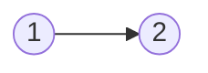

## Palindrome Linked List

**Problem:**  
Given the head of a singly linked list, determine whether the list is a palindrome. Return `true` if it is, or `false` otherwise.

---

### **Examples**

**Example 1:**  

- **Input:**  
  `head = [1, 2, 2, 1]`
- **Output:**  
  `true`

**Example 2:**  

- **Input:**  
  `head = [1, 2]`
- **Output:**  
  `false`

---

### **Constraints**
1. The number of nodes in the list is in the range `[1, 10^5]`.
2. `0 <= Node.val <= 9`.

---

### **Follow-Up Challenge**
Can you solve this problem in `O(n)` time and `O(1)` space?

---

## **Source of Problem**
[Leetcode Palindrome Linked List Problem](https://leetcode.com/problems/palindrome-linked-list/description/)
